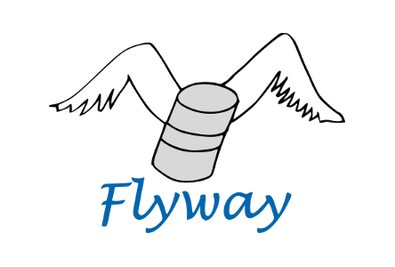
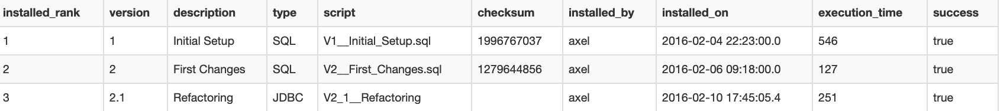

<section data-markdown data-separator="^\n----\n$" data-vertical="^\n---\n$">

## Introduction and Best Practices

---

## What is Flyway

* Open Source
* Handles Database Migration
* Versioned & immutable SQL Scripts

----

## What are the benefits

* Reproducible db state
* Know the version of your schema
* Quick and easy setup of new environments
* Supports zero-downtime updates
* Application maintains DB schema state

----

## How does it work?

* Schema version table
* Flyway checks all versions
    * Fails on checksum mismatch
    * Only applies not already executed scripts
    
----

## How to use it?

* Command Line (flyway migrate)
* Java API ==> Spring integration
* Maven API
* Gradle API

---

## Best Practices

* Use idempotent operations
    * Check if item already exists
* Use Baseline (if DB already set up without flyway)
* Use DB independent scripts
* Do not add sample data

----

## Best Practices Continued

* Do not create users with migrations
* Always roll forward
* Do not change existing scripts
* Stay backwards compatible to the previous software version

---

# Demo

</section>
